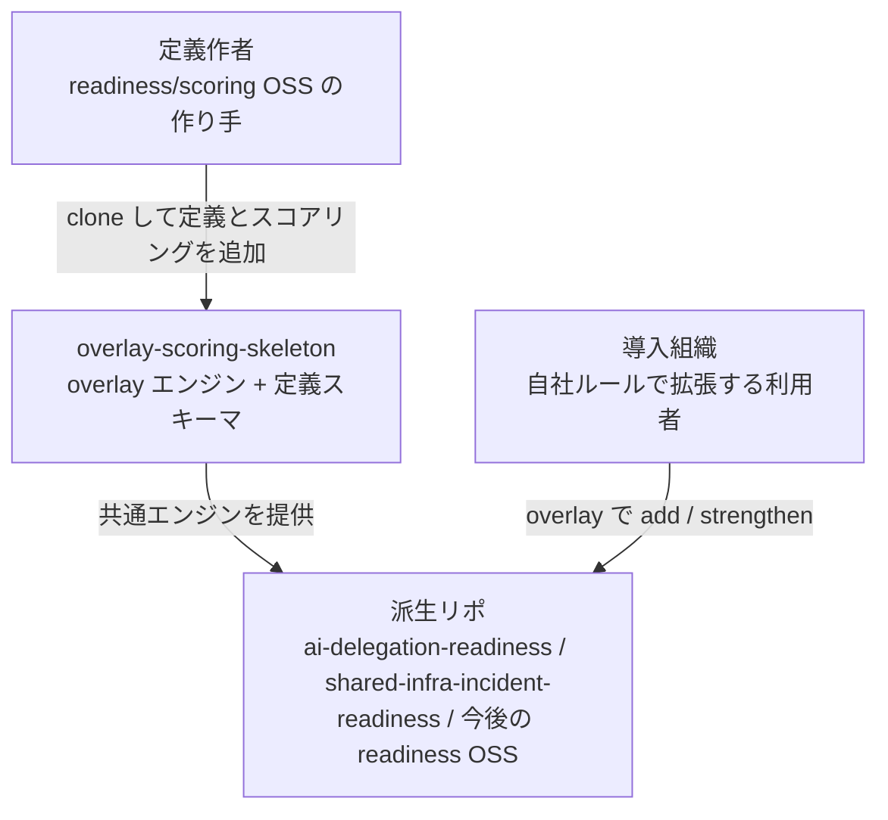
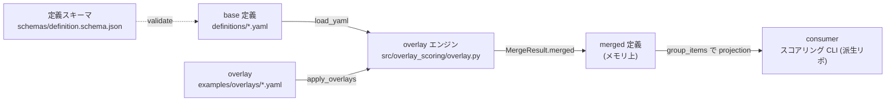
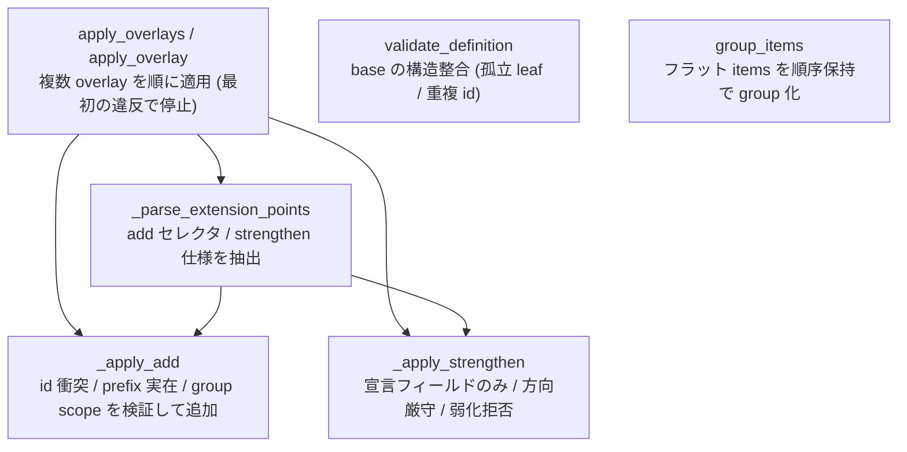
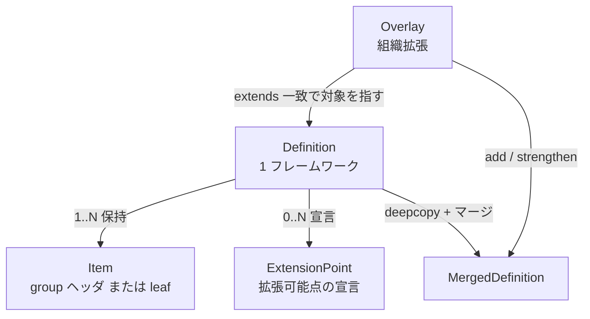
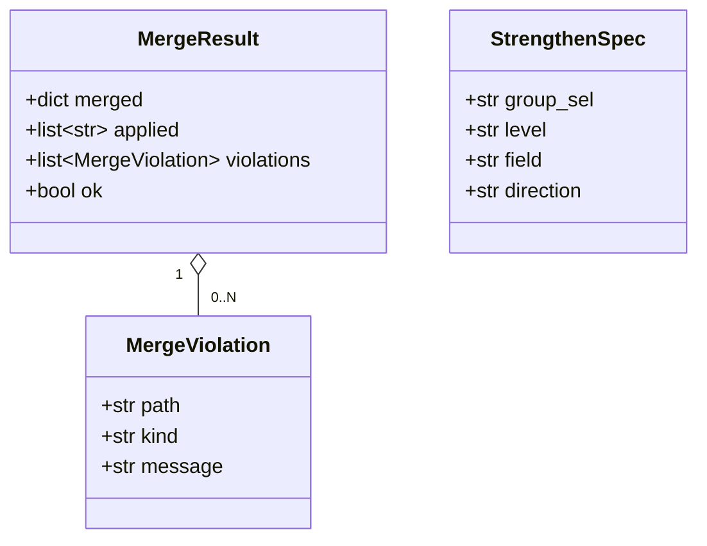

# アーキテクチャ (as-built)

overlay-scoring-skeleton は、**rules-as-data で書いた readiness / scoring 定義を、組織ごとに安全に拡張する overlay エンジン**の起点テンプレートです。新しい readiness/scoring 系リポは、このリポを clone して定義とスコアリングだけを足すことで、拡張モデル (add / strengthen) と検証ロジックを再実装せずに済みます。

## 構造 (C4)

### システムコンテキスト

- **定義作者**: フラットな `items` 定義とスコアリング CLI を書く。エンジンと検証は skeleton から継承する。
- **導入組織**: 派生リポの base 定義を fork せず、overlay で項目追加・閾値厳格化だけ行う。
- **派生リポ**: skeleton のエンジンを複製し、ドメイン固有の定義 (`definitions/*.yaml`) と consumer (スコアリング CLI) を持つ。

### コンテナ

| コンテナ | 役割 |
|---|---|
| base 定義 | フラット `items` リスト。`extension_points` で拡張可能点を宣言する正本 |
| overlay | 組織固有の `add` / `strengthen`。base を書き換えず重ねる |
| overlay エンジン | overlay を検証しながら base に適用し merged 定義を返す。派生リポへ複製する |
| 定義スキーマ | id 規約・extension_points 形状を JSON Schema で enforce |
| consumer | merged 定義を `group_items` で group 化して読み、スコア/verdict を出す (派生リポ側) |

### コンポーネント (エンジン内部)

## データ

### 概念モデル

| エンティティ | 説明 |
|---|---|
| Definition | 1 つの readiness/scoring フレームワーク。`name` / `separator` / `extension_points` / `items` |
| Item | `items` の 1 要素。id が `<group>` ならヘッダ (group レベル数値を持つ)、`<group>.<leaf>` なら leaf (明細 + opaque payload) |
| ExtensionPoint | overlay で何が許されるかの宣言。`{group セレクタ, allow: add|strengthen, level, field, direction}` |
| Overlay | `extends` で base を指し、`add` (項目追加) と `strengthen` (数値厳格化) のみ行う |
| MergedDefinition | base を deepcopy し overlay を適用した結果。source order は保持される |

### 情報モデル (エンジンの返り値)

- `MergeResult.ok` は `violations` が空のとき真。consumer は `ok` が偽なら例外にする。
- `MergeViolation.kind` の例: `extends_mismatch` / `id_collision` / `unknown_group` / `weakening_rejected` / `unsupported_op` / `invalid_overlay`。
- `StrengthenSpec` は `extension_points` から抽出した strengthen 可能フィールドの内部表現。

### id 規約 (1 階層固定)

- `<group>` (セパレータ無し) = group ヘッダ。group レベルの数値 (合否閾値・SLA など) を持つ。
- `<group>.<leaf>` (セパレータ 1 個) = leaf。明細フィールドと、エンジンが解釈しない opaque payload を持つ。
- **ungrouped leaf (セパレータ無しの非ヘッダ) は不可**。leaf の `<group>` prefix は必ず実在するヘッダを指す (タイプミスは検証で弾かれる)。
